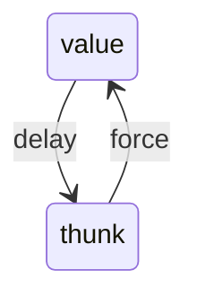

I struggled with the problem for a few days. 5.25 is such a challenging problem
from the "open-ended" nature of it. There is an "example" approach available,
but we have to write a lot of new code and modify various places of the current
code to make it works. For me, not being a fluent assembly language programmer
(or at least in Chapter 5's Scheme Assembly) is another difficulty. I made it
out in the end, and wanted to share what did I went through.

The full answer can be found on my
[GitHub](https://github.com/thanhnguyen2187/sicp-notes/blob/master/allcode/ch5-25.scm).

## Background

In chapter 5 of SICP, we explore the "register machine" computation model, and
get provided a simulation for that register machine. The simulator has its own
assembly-like language, in which statements are "operations" that works with
"registers" and a "stack" (the operations can modify a register, or push/pop
values from the stack). Instead of having procedures to call, we have "label",
which is kind of a mark, and a "goto" operation to simulate that. Looping and
recursion are also implemented by using label and gotos.

For example, this factorial procedure:

```lisp
(define (factorial x)
  (if (= x 0)
    1
    (* x (factorial (- x 1)))))
```

Gets translated into:

```lisp
(controller
   (assign continue (label fact-done))     ; set up final return address
 fact-loop
   (test (op =) (reg n) (const 1))
   (branch (label base-case))
   ;; Set up for the recursive call by saving n and continue.
   ;; Set up continue so that the computation will continue
   ;; at after-fact when the subroutine returns.
   (save continue)
   (save n)
   (assign n (op -) (reg n) (const 1))
   (assign continue (label after-fact))
   (goto (label fact-loop))
 after-fact
   (restore n)
   (restore continue)
   (assign val (op *) (reg n) (reg val))   ; val now contains n(n-1)!
   (goto (reg continue))                   ; return to caller
 base-case
   (assign val (const 1))                  ; base case: 1!=1
   (goto (reg continue))                   ; return to caller
 fact-done)
```

The evaluator written in this chapter is called "Explicit Control Evaluator",
using the Scheme Assembly like this:

```lisp
(define eceval
  (make-machine
   '(exp env val proc argl continue unev)
   eceval-operations
  '(
;;SECTION 5.4.4
read-eval-print-loop
  (perform (op initialize-stack))
  (perform
   (op prompt-for-input) (const ";;; EC-Eval input:"))
  (assign exp (op read))
  (assign env (op get-global-environment))
  (assign continue (label print-result))
  (goto (label eval-dispatch))
  ...
  )))
```

- `(exp env val ...)` are the register names that we need.
- `eceval-operations` is a "cheat" to use "normal" Scheme procedures within the
  evaluator:

  ```lisp
  (define eceval-operations
    (list
     ;;primitive Scheme operations
     (list 'read read)
  
     ;;operations in syntax.scm
     (list 'self-evaluating? self-evaluating?)
     (list 'quoted? quoted?)
     (list 'text-of-quotation text-of-quotation)
     (list 'variable? variable?)
     (list 'assignment? assignment?)
     ...
     ))
  ```

## Description

> **Exercise 5.25**: Modify the evaluator so that is uses normal-order
> evaluation, based on the lazy evaluator of Section 4.2.

It took me a while to fully recall what Chapter 4 is about, and how does the
lazy evaluator work, and the relevant terms ("thunk", "delay" and "force"):

> 4.2.2 An interpreter with Lazy Evaluation
>
> The basic idea is that, when applying a procedure, the interpreter must
> determine which arguments are to be evaluated and which are to be delayed.
>
> The delayed arguments are not evaluated; instead, they are transformed into
> objects called *thunks*. The thunk must contain the information required to
> produce the value of the argument when it is needed, as if it had been
> evaluated at the time of the application.
>
> The process of evaluating the expression in a thunk is called *forcing*. In
> general, a thunk will be forced only when its value is needed:
>
> [...]

Suppose "value" is the term we use for... normal values (a "number" like `1`, or
`2`, or a "symbol" like `a`, or `b`, or `c`), we can see this state diagram:



```lisp
(define a (delay 10))
; (thunk 10 env)
(force a)
; 10

(define b (delay (/ 1 0)))
; (thunk (/ 1 0) env)
(force b)
; error
```

## Implementation

### Coming Up With The Approach

For Chapter 4, there is a section named "Modifying the evaluator". The places
that need to be changed are:

- The output printing: we need to force the value
- `if`'s predicate: we also need to force the predicate
- Function application:
  - We force the operator (the procedure that is being applied) to have its
    value (for example, when evaluating `(+ 1 2)`, `+` must be forced; it might
    seem... unnecessary in this case, but we can imagine if something like `((thunk
    my-proc) a b)` gets returned, then `my-proc` is the one that is needed)
  - We force the arguments for primitive ones, and let it be for compound
    (user-defined) ones

More on function application, the steps to evaluate an application are:

1. Get the "operator": `+`
2. Find the real procedure behind the symbol: `+` corresponds to Scheme's
   primitive `+` in this case; `f`, or `g`, or `my-proc` corresponds to the
   user's procedure.
3. Get the "operands": `(1 2 3)`
4. Do the application

Chapter 4's evaluator implementation differs from chapter 5's one in the sense
that the operands are not touched until step 4, while in chapter 4, the operands
are evaluated as they are parsed.

Because of the difference, the working strategy is then to:

- Change the immediate evaluation to delaying
- Implement `list-of-arg-values`, which force the delayed operands

### Adding Needed Operations

Here are the procedures that are used in Chapter 4's lazy evaluator. Some are
used as references, and others are used directly in order to solve the problem.

```lisp
(define (thunk? obj)
  (tagged-list? obj 'thunk))

(define (thunk-exp thunk) (cadr thunk))
(define (thunk-env thunk) (caddr thunk))

(define (evaluated-thunk? obj)
  (tagged-list? obj 'evaluated-thunk))

(define (thunk-value evaluated-thunk) (cadr evaluated-thunk))

(define (force-it obj)
  (cond ((thunk? obj)
         (let ((result (actual-value
                        (thunk-exp obj)
                        (thunk-env obj))))
           (set-car! obj 'evaluated-thunk)
           (set-car! (cdr obj) result)  ; replace exp with its value
           (set-cdr! (cdr obj) '())     ; forget unneeded env
           result))
        ((evaluated-thunk? obj)
         (thunk-value obj))
        (else obj)))

(define (delay-it exp env)
  (list 'thunk exp env))

(define (actual-value exp env)
  (force-it (eval exp env)))

(define (list-of-arg-values exps env)
  (if (no-operands? exps)
      '()
      (cons (actual-value (first-operand exps) env)
            (list-of-arg-values (rest-operands exps)
                                env))))

(define (list-of-delayed-args exps env)
  (if (no-operands? exps)
      '()
      (cons (delay-it (first-operand exps) env)
            (list-of-delayed-args (rest-operands exps)
                                  env))))
```

The ones that are used in `eceval-operations` are:

```lisp
(define eceval-operations
  (list
   ;;primitive Scheme operations
   (list 'read read)

   ;;operations in syntax.scm
   ...
   ;; Exercise 5.25
   (list 'thunk? thunk?)
   (list 'thunk-exp thunk-exp)
   (list 'thunk-env thunk-env)
   (list 'evaluated-thunk? evaluated-thunk?)
   (list 'thunk-value thunk-value)
   ;;

   ...
   )
```

It might be tempting to use `force-it`, `actual-value`, and `list-of-arg-values`
directly like this:

```lisp
print-result
;;**following instruction optional -- if use it, need monitored stack
  (perform (op print-stack-statistics))
  (perform
   (op announce-output) (const ";;; EC-Eval value:"))
  ;; Exercise 5.25
  (perform (op force-it) (reg val))
  ;;
  (perform (op user-print) (reg val))
  (goto (label read-eval-print-loop))
```

But it doesn't work, since `force-it` and `actual-value` depend on each other, and
`actual-value` needs `eval` to work. Chapter 5's `eval` is implemented as
`eval-dispatch`, and it cannot be invoked "from outside".

### Implementing `force-it`, `delay-it`, and `actual-value`

It did not took me long to come up with the code:

```lisp
force-it
  ; 1. check if `exp` is a thunk
  (test (op thunk?) (reg exp))
  (branch (label force-it-thunk))
  ; 2. check if `exp` is an evaluated thunk
  (test (op evaluated-thunk?) (reg exp))
  (branch (label force-it-evaluated-thunk))
  ; 3. just return `exp`
  (assign val (reg exp))
  (goto (reg continue))
force-it-thunk
  (save exp)
  (assign exp (op thunk-exp) (reg exp))
  (save continue)
  (assign continue (label force-it-thunk-1))
  (goto (label actual-value))
force-it-thunk-1
  (restore continue)
  (restore exp)
  (perform (op set-car!) (reg exp) (const evaluated-thunk))
  (assign exp (op cdr) (reg exp))
  (perform (op set-car!) (reg exp) (reg val))
  (goto (reg continue))
force-it-evaluated-thunk
  (assign val (op thunk-value) (reg exp))
  (goto (reg continue))

actual-value
  ; 1. evaluate `exp`
  (save continue)
  (assign continue (label actual-value-1))
  (goto (label eval-dispatch))
actual-value-1
  ; 2. assign `val` to `exp` for forcing
  (restore continue)
  (assign exp (reg val))
  (goto (label force-it))

delay-it
  (assign val (op list) (const thunk) (reg exp))
  (goto (reg continue))
```

There is a "small" change of `delay-it` and `force-it`, which is the removal of
`env` on the assumption that at the execution time, `env` is going to be the
right one. I found that there might be subtle bug for this, but I found none as
far as my simple tests go.

### Forcing In `print-result`

```lisp
print-result
;;**following instruction optional -- if use it, need monitored stack
  (perform (op print-stack-statistics))
  (perform
   (op announce-output) (const ";;; EC-Eval value:"))
  ;; Exercise 5.25
  (assign exp (reg val))
  (assign continue (label print-result-1))
  (goto (label force-it))
print-result-1
  ;;
  (perform (op user-print) (reg val))
  (goto (label read-eval-print-loop))
```

### Forcing `if`'s Predicate

```lisp
ev-if
  (save exp)
  (save env)
  (save continue)
  (assign continue (label ev-if-decide))
  (assign exp (op if-predicate) (reg exp))
  ;; Exercse 5.25
  (save continue)
  (assign continue (label ev-if-1))
  (goto (label force-it))
ev-if-1
  (restore continue)
  (assign exp (reg val))
  ;;
  (goto (label eval-dispatch))
ev-if-decide
  (restore continue)
  (restore env)
  (restore exp)
  (test (op true?) (reg val))
  (branch (label ev-if-consequent))
```

The same goes to forcing an application's operator:

```lisp
ev-application
  (save continue)
  (save env)
  (assign unev (op operands) (reg exp))
  (save unev)
  (assign exp (op operator) (reg exp))
  (assign continue (label ev-appl-did-operator))
  (goto (label eval-dispatch))
ev-appl-did-operator
  (restore unev)
  (restore env)
  ;; Exercise 5.25
  ; force proc
  (assign exp (reg val))
  (assign continue (label ev-appl-did-operator-1))
  (goto (label force-it))
ev-appl-did-operator-1
  ;;
  (assign argl (op empty-arglist))
  (assign proc (reg val))
  (test (op no-operands?) (reg unev))
  (branch (label apply-dispatch))
  (save proc)
```


```lisp
ev-appl-operand-loop
  (save argl)
  (assign exp (op first-operand) (reg unev))
  (test (op last-operand?) (reg unev))
  (branch (label ev-appl-last-arg))
  (save env)
  (save unev)
  (assign continue (label ev-appl-accumulate-arg))
  ;; Exercise 5.25
  ; change from evaluating to delaying
  ; (goto (label eval-dispatch))
  (goto (label delay-it))
  ;;
```

```lisp
ev-appl-last-arg
  (assign continue (label ev-appl-accum-last-arg))
  ;; Exercise 5.25
  ; change from evaluating to delaying
  ; (goto (label eval-dispatch))
  (goto (label delay-it))
  ;;
```

```lisp
primitive-apply
  ;; Exercse 5.25
  (save continue)
  (assign continue (label primitive-apply-1))
  (goto (label list-of-arg-values))
primitive-apply-1
  (assign argl (reg unev))
  (restore continue)
  ;;
  (assign val (op apply-primitive-procedure)
              (reg proc)
              (reg argl))
  (restore continue)
  (goto (reg continue))
```

Finally, we implement `list-of-arg-values`, which tries to force every single
arguments of `argl` and put the result into `unev`:

```lisp
list-of-arg-values
list-of-arg-values-loop
  (test (op no-operands?) (reg argl))
  (branch (label list-of-arg-values-base-case))

  (save continue)

  (assign exp (op first-operand) (reg argl))
  (assign argl (op cdr) (reg argl))
  (assign continue (label list-of-arg-values-loop-1))

  (save argl)
  (goto (label force-it))
list-of-arg-values-loop-1
  (restore argl)

  (save val)
  (assign continue (label list-of-arg-values-after-loop))

  (goto (label list-of-arg-values-loop))
list-of-arg-values-after-loop
  (restore val)
  (restore continue)
  (assign unev (op cons) (reg val) (reg unev))
  (goto (reg continue))
list-of-arg-values-base-case
  (assign unev (const ()))
  (goto (reg continue))
```

I encountered a really weird bug and wasted a lot of time fixing it when I was
done implementing `list-of-arg-values`, which is:

- Evaluating a single application works:
  
  ```lisp
  (+ 1 2)
  ; 3
  ```

- Evaluating nested applications returns wrong result:

  ```lisp
  (+ 1 2 (+ 3 4))
  ; 17
  ```

The bug comes from my lack of pushing and popping `argl` before forcing any
element of `argl`:

```lisp
list-of-arg-values
list-of-arg-values-loop
  (test (op no-operands?) (reg argl))
  (branch (label list-of-arg-values-base-case))

  (save continue)

  (assign exp (op first-operand) (reg argl))
  (assign argl (op cdr) (reg argl))
  (assign continue (label list-of-arg-values-loop-1))

  ; this was missing
  ; (save argl)
  (goto (label force-it))
list-of-arg-values-loop-1
  (restore argl)

  ; this was missing
  ; (save val)
  (assign continue (label list-of-arg-values-after-loop))

  (goto (label list-of-arg-values-loop))
```

Which makes nested application store the redundant return value. For example:

```lisp
(+ 1 2 (+ 3 4))
; becomes
(+ 1 2 (+ 7 3 4))
```

After we are done with everything, lazy evaluation works:

```lisp
(define (try a b)
  (if (= a 0)
    1
    b))
; ok

(try 0 (/ 1 0))
; 1

(define (lazy-car a b) a)
; ok

(lazy-car 1 (/ 1 0))
; 1
```

## Conclusion

SICP is a challenging book. The exercises are especially so. I can see the value
behind it, however.

From not being that comfortable with assembly language (or at least with the
book's Scheme Assembly), I grew to understand how it works, and what are the
common idioms (looping and recursing with labels, gotos, and stack
pushing/popping), and appreciate how a "seemingly magic" high level programming
language (like Scheme) can be interpreted or compiled into a "straightforward"
low level programming language (like Scheme Assembly).

I also saw the trade-off between expressiveness and machine effectiveness: high
level programming languages have higher expressiveness, but lower machine
effectiveness, and vice versa for low level programmihng languages.

