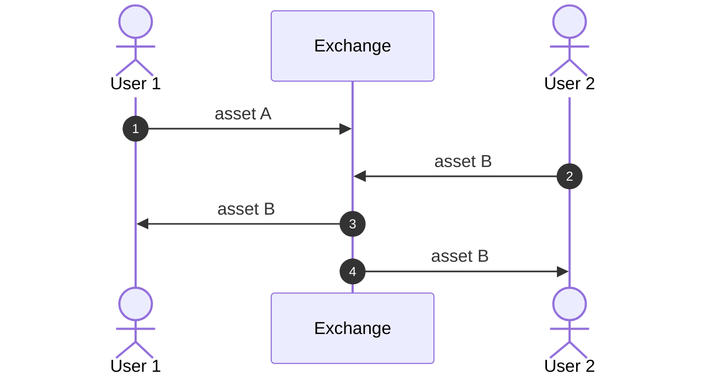
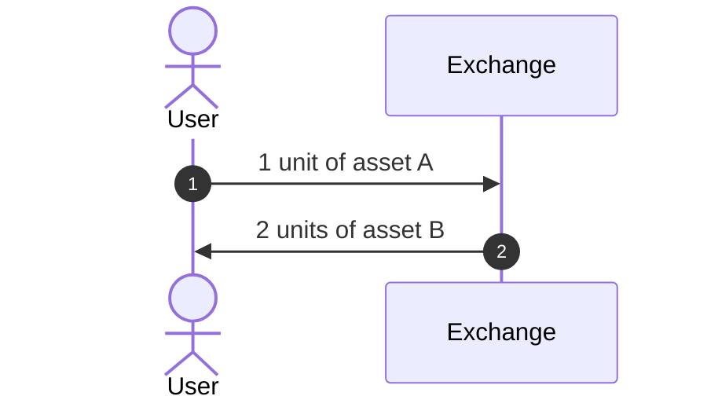
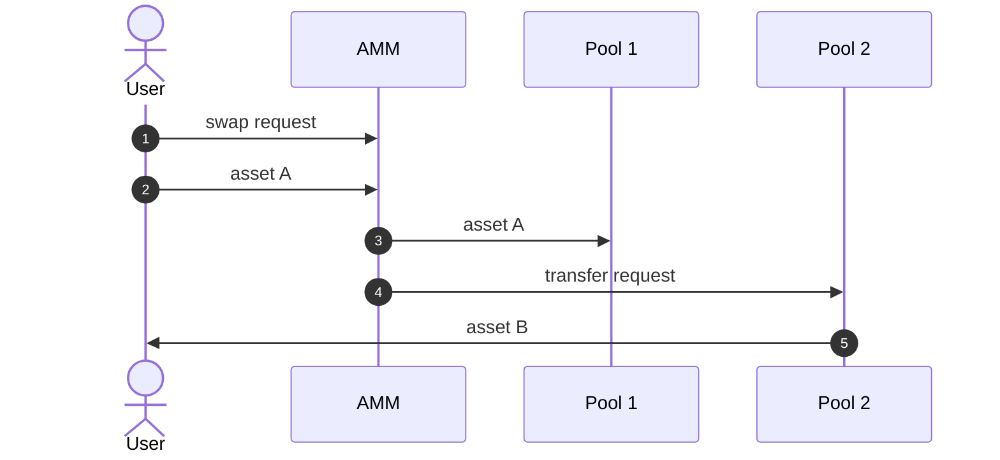
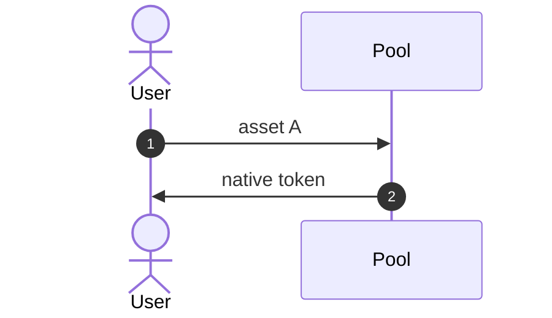
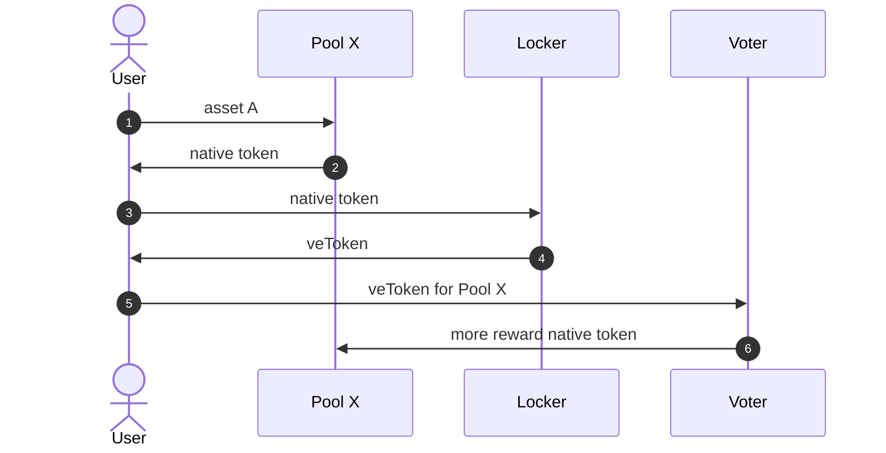
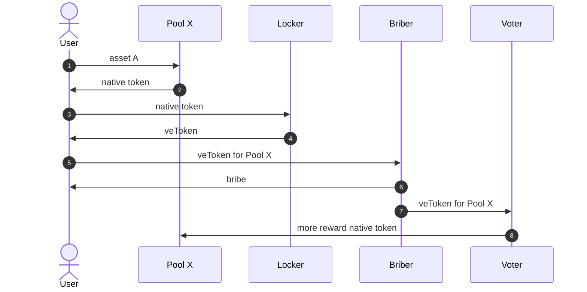

I don't know what is it like for other people, but I myself gets kind of...
overwhelmed by the complex flows of DeFi in general and DEXes in particular. The
terms "yield farming", "liquidity pool", "swap", "bribe", etc. are related, but
challenging to be connected. I hope that this post serve myself well on
explaining the complexity in a simple way, and potentially be helpful to other
people.

## Flow 1: Swapping

I prefer building things up gradually, so we'll start with this simple case that
is not DEX-related. Without getting deep into technical explanation, an exchange
is like a box, where you put something in one side, and get something else in
the other. Let us call that "something" an "asset".

User 1 is having asset A, and he wants to have asset B instead. User 2 is having
asset B, and she wants to have asset A instead. Both of them give up their
assets to the exchange, and receive the new assets they want.



Now, no matter if we put "centralized" or "decentralized" before "exchange", the
concept is the same. We put something in, and receive something else. A DEX, or
"decentralized exchange", is an exchange at its core, but it is "decentralized"
in the sense that instead of having the data and the calculation on a private
server (like a "centralized" one), we have the data stored on a blockchain and
the calculation also executed on it.

I strongly suspect that CEX, or centralized exchange, only gets popularized
following DEX's light (similar to how "heterosexual", or "straight", gets known
as the opposite of "homosexual", or "gay").

Adding an exchange ratio to asset A and asset B (1 units of asset A for 2 units
of asset B, for example) is also important, as we can rarely find assets that
can be equally exchanged (1:1 ratio). We commonly use the term "price" for this.



Maybe now the question is: who or what determine such ratio, or such price? I do
not have such knowledge, and can only give a vague answer: the market. Who or
what is "the market", you may continue asking, and something something relating
to "demand and supply" is my answer.

You can understand "demand and supply" as this scenario: you sell apples, and
there are people buying your apples. You are on the supply side, and your buyers
are on the demand side. Your apples (or asset)'s price depends on how much are
people willing to pay you. If you are the only apple seller in the world, then
we say "the supply is low and the demand is high", and therefore the price is
high. The reverse also applies, as if you are competing with many other apple
sellers, and there is only one buyer available, then we say "the supply is high
and the demand is low", and therefore the price is low.

## Flow 2: Liquidity Pools

I guess after we vaguely understand exchange and price, we start to question:
how does an exchange work, actually? For CEX, we only need to keep in mind that
there is an "order book" behind. An "order book" stores "buy order" and "sell
order" somewhere, and it simply tries to match the orders, thus execute the
swapping we mentioned above.

For example, an order book might contains orders that look like this:

```
- buy asset A with price 1.07
- buy asset A with price 1.05
- buy asset A with price 1

- sell asset A with price 1.05
- sell asset A with price 1.07
- sell asset A with price 1.09
```

DEX does not have the same model, however. Even though a blockchain can be both
a database and a computer that execute code (smart contract), it is
decentralized by its nature, and its processing speed is limited by the
decentralization. The low processing throughput is the major problem of an
on-chain order books.

It turns out that people overcame that limitation by these two ideas:

1. We can keep asset A and asset B in two on-chain vaults, and
2. Create something that automatically move the asset from the vaults to people
   that request swapping

The vaults in 1 is called "liquidity pools", and something of 2 is called an
"automated market maker", often shortened to AMM. Let us wrongly simplify the
interaction by saying that the user asks for a swap directly at the AMM:



Now, I guess you had a quite clear idea of what a liquidity pool is. A question
is: who provide the asset to liquidity pools? The DEX creators can be one, but
oftenly, they encourage other people to do that, and do it by providing
incentive. Putting your asset into a liquidity pool is often called "staking".
A part of the swapping fee and some "native token" (or the asset that the DEX
creators created themselves) is the reward for staking.

Again, I'm wrongly simplifying the interaction for the sake of explainability:



## Flow 3: Vote Escrow and Bribe

On the native token, for the DEX creators, they do not want to make their asset
only have one purpose---being sold rightaway after the rewarding---so they avoid
the selling by telling people to locking it somewhere, and in exchange of the
locking, people receive another token. This another token has the power at
deciding how many native token are we going to receive from a particular
liquidity pool. The term for this another token is called "vote escrow token",
and it is abbreviated to "veToken" in this flow:



You may also encounter the term "gauge voting", which is the shorthand for
action 5.

This money begets money situation leads to the scenario where some actors want
to accrue veToken for themselves and get more native token generated to their
pools. To accrue the veToken, they pay the user other token that is called
"bribe".



## Conclusion

I walked you through a ton of terms and explanation, from the most basic
non-DeFi concepts to the most advanced, "state of the art", models. I hope that
it is enough for my readers to get a general skeleton of the field (DEX, or
decentralized exchange) and its related informations.

